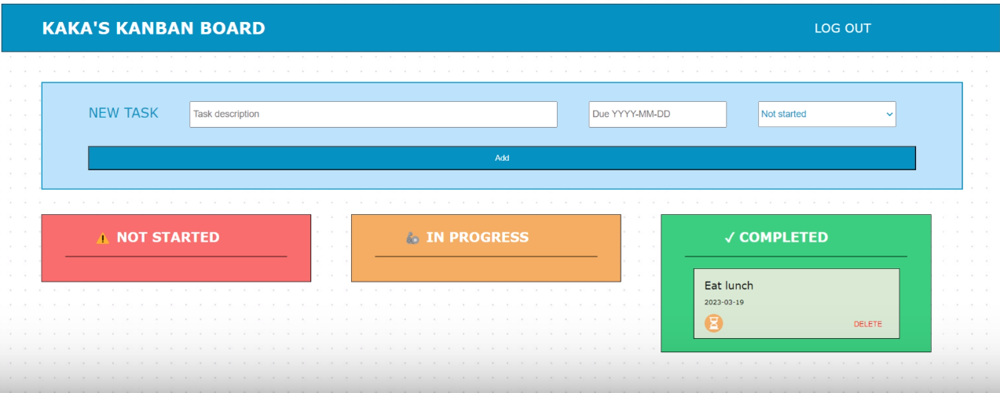

# Kanban board assignment
## Description

**Demo** https://www.loom.com/share/ac21daec9faf45188c819401d4dc72de 

Following the instructions, I made a simple Kanban board app with three states:

1. Not started
2. In progress
3. Completed



My app has the required functionalities:

1. Creating a new task
    - Users can add their own titles, deadlines, and select from the options 
    of task types which correspond to the current state of the task.
2. Moving tasks to different states
    - Each task can be easily moved to another state with clickable icon buttons
    - Since the icons can be confusing, the users can see what each icon does by
    hovering over them.
3. Deleting tasks
    - All tasks can be deleted, but users are asked for a confirmation of this action.

These functionaliities are only available to logged in users.

NOTE: I closely followed the tutorial on Blog website from the flask.palletsprojects.com provided in this course. 
Most functionalities were taken directly from the tutorial.

## Installation

To run this app:

**macOS:**
```bash
python3 -m venv venv
source venv/bin/activate
pip3 install -r requirements.txt
python -m flask run
```

**Windows:**
```bash
python3 -m venv venv
venv\Scripts\activate.bat
pip3 install -r requirements.txt
python3 -m flask run
```

## Testing
I included tests that target specific units, including authentication functionalities and basic board functionalities.

```bash
pip install pytest coverage
pytest
```
For more information:
```bash
coverage run -m pytest
```
```bash
Requirements:
attrs==22.2.0
click==8.1.3
colorama==0.4.6
coverage==7.2.2
Flask==2.2.3
iniconfig==2.0.0
itsdangerous==2.1.2
Jinja2==3.1.2
MarkupSafe==2.1.2
packaging==23.0
pluggy==1.0.0
pytest==7.2.2
Werkzeug==2.2.3
```


## HCs and LOs

**#cs162-communication:** I provided comments for all important parts of the code and named variables clearly. Anyone can easily infer relevant functions from the names given. I acknowledged the sources I used and tried my best to provide relevant information in the demo.

**#cs162-testing:** I used the pytest module to test the user registration, log in, log out functionalities, error messages, database operations, and some of the board-related functions.

**#cs162-webstandards:** I used the standard conventions and best practices to enhance the user experience. The biggest example of this are the clear user guiding elements. For example, when the user adds a new task, they know which box corresponds to which type of input by looking at the default text. They do not have to manually input the task status because there is a dropdown menu provided. I took some liberties with the buttons but provided alternative titles, so anyone can easily navigate the switching functions. For the potentially dangerous action of deleting, the user is warned with a confirmation message. Web standards are used in this project to support user-friendly design.

**#cs162-separationofconcerns:** I tried my best to ensure that each function supports one type of task performed by the user, so the delete, update, and create functions are all separate. I think an effective choice was to implement all these functions on a single page containing all the tasks, so that viewers can immediately see what is happening without having to go back-and-forth between uselessly separated create and update pages. 

**communicationdesign:** I applied basic principles of design and symmetry to enhance the user-friendliness of my design. By keeping the user in mind, I prioritized having the tasks separated into 3 separate columns, so the users have a visual shorthand for how much they have not yet started or have in progress. I used the rule of 3s to align all the elements at focal points. I added visually descriptive buttons instead of sticking with a text, since the tasks already have text descriptions (I did still add text alternatives just in case the icons could be confusing). It makes it easier to see what is an action and what is a descriptor. The three separate colors further help emphasize the different tasks statuses. 

**designthinking:** As submitted previously, the first iteration of my design had a dark background with all the task columns in the same colors and the "add new" functionality kept at each separate board. Through empathy exercises and my own research on existing designs, I derived some pain points - there are no distinctions between statuses and the look of the web is too dim, especially for tired users with many tasks. Thus, I settled on a design that separated the "add-new" task supplementing it with an easy-to-navigate dropdown menu. I also added different colors to the status columns in a way that warns users of their undone tasks but doesn't hurt their eyes. The dotted background provides a nice sketchbook feel which is consistent with "drawing up some new tasks". I iterated through 2 large design variations, but the small details changed quite a bit even in the latest iteration. For example, the iteration right before this final design had text buttons. Thus, I kept incrementally improving my design for optimal results.